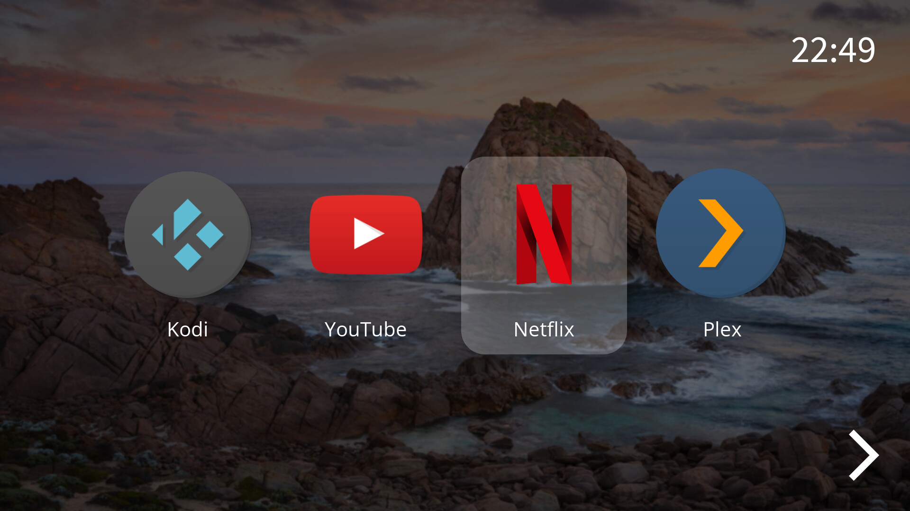

<div align="center">
  <a>
    
  </a>


# Flex Launcher
</div>
<details open>
  <summary>Table of Contents</summary>
  <ol>
    <li>
      <a href="#about">About</a>
    </li>
    <li>
      <a href="#screenshots">Screenshots</a>
    </li>
    <li>
      <a href="#installation">Installation</a>
      <ul>
        <li><a href="#windows">Windows</a></li>
        <li><a href="#linux">Linux</a></li>
      </ul>
    </li>
    <li><a href="#usage">Usage</a></li>
      <ul>
        <li><a href="#controls">Controls</a></li>
        <li><a href="#debugging">Debugging</a></li>
      </ul>
    <li><a href="#contributing">Contributing</a></li>
    <li><a href="#documentation">Documentation</a></li>
    <li><a href="#credits">Credits</a></li>
  </ol>
</details>

## About
Flex Launcher is a customizable application launcher designed with a [10 foot user interface](https://en.wikipedia.org/wiki/10-foot_user_interface). Its intended purpose is to simplify the control of a home theater or couch gaming PC by providing an interface that is similar to a TV set-top box or game console. Flex Launcher allows you to launch applications on your living room PC entirely by use of a TV remote or a gamepad. No keyboard or mouse required!

Flex Launcher is compatible with both Windows and Linux (including Raspberry Pi devices).

## Screenshots



## Installation
Compiled binaries are available for Windows 64 bit, Linux x86-64, and Raspberry Pi. Alternatively, you may also choose to compile the program yourself using the [compilation guide](docs/compilation.md).

### Windows
A win64 zip file is provided on the [release page](https://github.com/complexlogic/flex-launcher/releases). Simply download the file and extract the contents to a directory of your choosing. Flex Launcher should be run on an up-to-date Windows 10 system, or Windows 11.

### Linux
Binary packages are available on the [release page](https://github.com/complexlogic/flex-launcher/releases) for APT and pacman based distributions. You may use the commands below to install.

#### APT-based x86-64 Distributions (Debian, Ubuntu, etc.)
This package is compatible with Debian Bullseye and later, Ubuntu 21.04 and later.
```
VERSION=1.6.1
wget https://github.com/complexlogic/flex-launcher/releases/download/v${VERSION}/flex-launcher_${VERSION}_amd64.deb
sudo apt install ./flex-launcher_${VERSION}_amd64.deb
```
#### Pacman-based x86-64 Distributions (Arch, Manjaro, etc.)
```
VERSION=1.6.1
wget https://github.com/complexlogic/flex-launcher/releases/download/v${VERSION}/flex-launcher-${VERSION}-1-x86_64.pkg.tar.zst
sudo pacman -U flex-launcher-${VERSION}-1-x86_64.pkg.tar.zst
```
#### Raspberry Pi
This package is compatible with Raspbian Bullseye and later.
```
VERSION=1.6.1
wget https://github.com/complexlogic/flex-launcher/releases/download/v${VERSION}/flex-launcher_${VERSION}_armhf.deb
sudo apt install ./flex-launcher_${VERSION}_armhf.deb
```
#### Copying Assets to Home Directory
The Linux packages install a default config file and assets to /usr/share/flex-launcher. It is strongly recommended to NOT edit this config file directly, as it will be overwritten if you upgrade to a later version of Flex Launcher. Instead, copy these files to your home directory and edit it there.
```
cp -r /usr/share/flex-launcher ~/.config
sed -i "s|/usr/share/flex-launcher|$HOME/.config/flex-launcher|g" ~/.config/flex-launcher/config.ini
```

## Usage
Flex Launcher uses an INI file to configure the menus and settings. Upon  startup, the program will search for a file named ```config.ini``` in the following locations in order:
1. The current working directory
2. The directory containing the ```flex-launcher``` executable
3. Linux only: ```~/.config/flex-launcher```
4. Linux only: ```/usr/share/flex-launcher```

If your config file is in one of the above locations, Flex Launcher can be started simply by double clicking the executable file or adding it to autostart. If your config file is in a non-standard location, you must specify the path via command line argument:
```
flex-launcher -c /path/to/config.ini
```
Flex Launcher ships with a default config file which is intended strictly for demonstration purposes. If you try to start one of the applications, it is possible that nothing will happen because the install path is different on your system, or you don't have the application installed at all. See the [configuration file documentation](docs/configuration.md#configuring-flex-launcher) for instuctions on how to change the menus and settings.

### Controls
The keyboard arrow keys move the highlight cursor left and right. Enter selects the current entry, backspace goes back to the previous menu (if applicable), and Esc quits the program. 

#### TV Remotes
Flex Launcher does not feature built-in decoding of IR or CEC signals. If you plan to use a TV remote to control the device, it is assumed that these signals are decoded by the OS or another program and mapped to keyboard presses, which can then be received by Flex Launcher. You can also use a hardware-based solution, such as the FLIRC USB device 

#### Gamepads
Gamepad controls are built-in to the program, but are disabled by default. To enable them, open your configuration file and, under the "Gamepad" section, change the "Enabled" setting from false to true. After that, the gamepad controls should "Just Work" for most users. If your gamepad is not recognized automatically, or you want to change the default controls, see the [gamepad controls documentation](docs/configuration.md#gamepad-controls).

### Debugging
Flex Launcher has a debug mode which may be enabled as follows:
```
flex-launcher -d
```
This will output a logfile named ```flex-launcher.log``` in the same directory as ```flex-launcher.exe``` on Windows, and in ```~/.local/share/flex-launcher``` on Linux. 

## Contributing
Contributions are welcome for bugfixes and new features. Please keep code formatted to [2 space K&R style](https://gist.github.com/jesseschalken/0f47a2b5a738ced9c845).

## Documentation
Here is a list of available documentation:
- [Configuration](docs/configuration.md#configuring-flex-launcher)
- [General Setup Guide](docs/setup.md#setup-guide)
  - [Windows-specific Setup Guide](docs/setup_windows.md#windows-setup-guide)
  - [Linux-specific Setup Guide](docs/setup_linux.md#linux-setup-guide)
- [Compilation Guide](docs/compilation.md#compilation-guide)

## Credits
Flex Launcher is made possible by the following projects:
- [SDL](https://github.com/libsdl-org/SDL), including the subprojects:
  - [SDL_image](https://github.com/libsdl-org/SDL_image)
  - [SDL_ttf](https://github.com/libsdl-org/SDL_ttf)
- [Nanosvg](https://github.com/memononen/nanosvg)
- [inih](https://github.com/benhoyt/inih)
- [Numix icons](https://github.com/numixproject)

The design of Flex Launcher was strongly influenced by the excellent desktop application launcher [xlunch](https://github.com/Tomas-M/xlunch).
